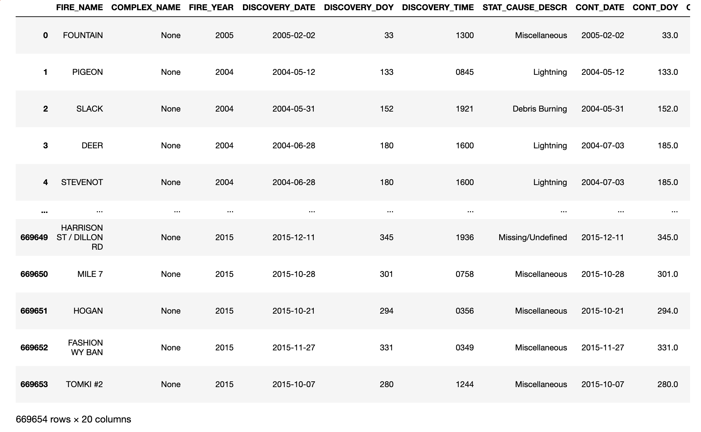
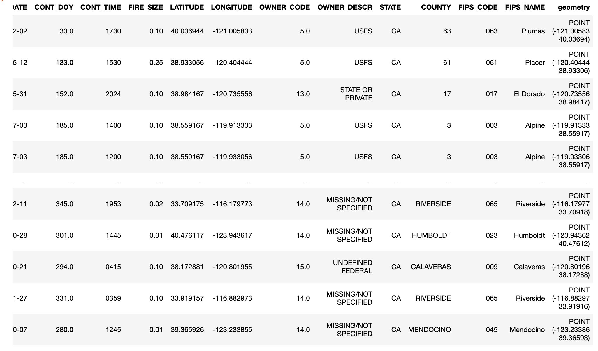

# Patterns of Destruction: A Century of Wildfires in the United States

## I. Introduction

Wildfires are becoming more destructive. Data shows an increasing trend in acreage burned per year. This increase also drives up the annual cost to control these destructive forces. The [Congressional Research Service](https://fas.org/sgp/crs/misc/IF10244.pdf) calculated the impact of wildland fires over the past decade (2011-2020). An average of 62,693 wildland fires annually, roughly 7.5 million acres annually are impacted by these fires. Although the majority of wildland fires occur in undeveloped areas which have little impact on communities or human development, they impact all of us. These fires occur mostly on federal lands (roughly 65%). Federal lands are land that is held in trust by the federal government, which is for the enjoyment of all Americans. Federal lands account for roughly 28% of land in the United States, approximately 640 million acres. 

[Population Density](https://www2.census.gov/geo/pdfs/maps-data/maps/thematic/us_popdensity_2010map.pdf) trends show how the majority of the U.S. population is not directly affected by these destructive forces. However, they do impact land that you as an American are entilted to recreate on. If you've ever been to one of the many national parks in the western part of the country, you've likely seen the effects of wildland fires. The increase in wildfires as well as their severity can be attributed to climate change. According to the [NOAA 2019 Global Climate Summary](https://www.ncdc.noaa.gov/sotc/global/201913), The five warmest years in the 1880–2019 record have all occurred since 2015, while nine of the 10 warmest years have occurred since 2005. The global annual temperature has increased at an average rate of 0.07°C (0.13°F) per decade since 1880 and over twice that rate (+0.18°C / +0.32°F) since 1981. Not only are temperatures rising, [precipitation levels are decreasing](https://www.epa.gov/climate-indicators/climate-change-indicators-drought). 

 

Data show that wildfires are mostly occur during the warmer, drier summer months. Specifically May through September. Climate change data indicates those months are also becoming warmer and more arid. The combination of these climatic changes have directly affected the frequency and severity of wildfires. 

This project serves as an educational tool to the large section of our population that is not affected first-hand by these destructive forces. For those who live without the threat of their homes being engulfed by wildfire, it is easy to forget the immense impact they have on such a massive part of the country. For those who do live with the cyclical threat of wildfires, this project will tell their story, the growing concern of how to manage wildfires as a naturally occurring process, as well as protecting property from their destructive path. 

Displaying wildfire data in a visual format allows the user to see patterns that would otherwise go unnoticed in a tabular form. The sheer size and quantity of this phenomena lends itself to visual representation. My hope is that through the exploration of this project, the user will become more aware of the trend of larger, and more frequent wildfires, and the impact climate change has had (and will continue to have). Bringing awareness to the issue is the first step towards developing solutions to the problem of living symbiotically with such a powerful, yet destructive natural force. 

## II. Methodology

Data for this project was acquired through a variety of sources listed below, then analyzed and cleaned and prepared for web mapping using QGIS and Python. Jupyter Notebooks were used to document data analysis and the data cleaning process for a transparent and replicable approach. 

### A. Data

[Wildfire data](https://www.fs.usda.gov/rds/archive/catalog/RDS-2013-0009.4) was downloaded as GDB, opened in QGIS and exported as a GeoJSON, which was then read in a Jupyter Notebook (`notebooks/wildfire-data.ipynb`) using the [GeoPandas](https://geopandas.org/) library. Analysis was performed using [pandas](https://pandas.pydata.org/) and [matplotlib](https://matplotlib.org/3.3.2/index.html) for visualizations. Unnecessary columns were dropped and records without discovery dates and contained dates were also dropped. After dropping records with incomplete discovery and contained dates, of the original 1.88 million records, 669,654 remained.

Sample Wildfire Data:

 

[Climate data](https://www.ncdc.noaa.gov/cag/national/time-series/110/tavg/all/1/1895-2020?base_prd=true&begbaseyear=1901&endbaseyear=2000) was downloaded as separate CSV files. One for historic temperatures, and one for historic precipitation. Each was loaded into a Jupyter Notebook (`notebooks/climate-data.ipynb`) using pandas. The data was fairly clean with one exception. The Date column concatenated year and month. After separating the month and year, separate columns were added for each. This aided in visualizing trends.

### B. Medium for Delivery

## Data Sources

[Combined wildfire datasets for the United States and certain territories, 1878-2019](https://www.sciencebase.gov/catalog/item/5ee13de982ce3bd58d7be7e7)

[Forest Area](https://data.worldbank.org/indicator/AG.LND.FRST.ZS?end=2016&start=1990)

[US Deforestation](https://www.globalforestwatch.org/dashboards/country/USA/?category=summary&location=WyJjb3VudHJ5IiwiVVNBIl0%3D&map=eyJjZW50ZXIiOnsibGF0Ijo1My4zODMzMjgzNjc1Nzk0NjYsImxuZyI6LTExNi42MzA4NTkzNzQ5ODUxMn0sImNhbkJvdW5kIjpmYWxzZSwiZGF0YXNldHMiOlt7ImRhdGFzZXQiOiJwb2xpdGljYWwtYm91bmRhcmllcyIsImxheWVycyI6WyJkaXNwdXRlZC1wb2xpdGljYWwtYm91bmRhcmllcyIsInBvbGl0aWNhbC1ib3VuZGFyaWVzIl0sImJvdW5kYXJ5Ijp0cnVlLCJvcGFjaXR5IjoxLCJ2aXNpYmlsaXR5Ijp0cnVlfSx7ImRhdGFzZXQiOiJ0cmVlLWNvdmVyLWxvc3MiLCJsYXllcnMiOlsidHJlZS1jb3Zlci1sb3NzIl0sIm9wYWNpdHkiOjEsInZpc2liaWxpdHkiOnRydWUsInBhcmFtcyI6eyJ0aHJlc2giOjMwLCJ2aXNpYmlsaXR5Ijp0cnVlfX1dfQ%3D%3D&national-land-cover-database=eyJpbnRlcmFjdGlvbiI6e319)

[Historical US temperature data](https://www.ncdc.noaa.gov/cag/national/time-series/110/tavg/all/1/1895-2020?base_prd=true&begbaseyear=1901&endbaseyear=2000)

### Data Description

Jupyter Notebooks for each dataset have been created for project transparency. The data as a whole is relatively clean with little need for deep data munging. Within the respective notebooks, the datasets are queried and plotted in order to visualize trends and patterns. The data notebooks are documented with notes to provide an open and easily replicable process for others to follow. 
