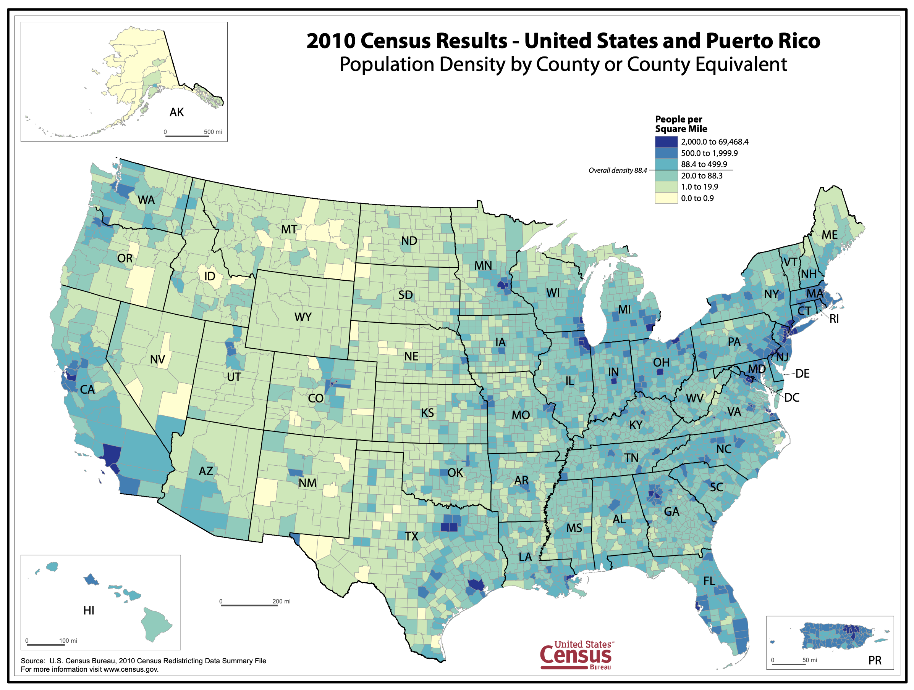
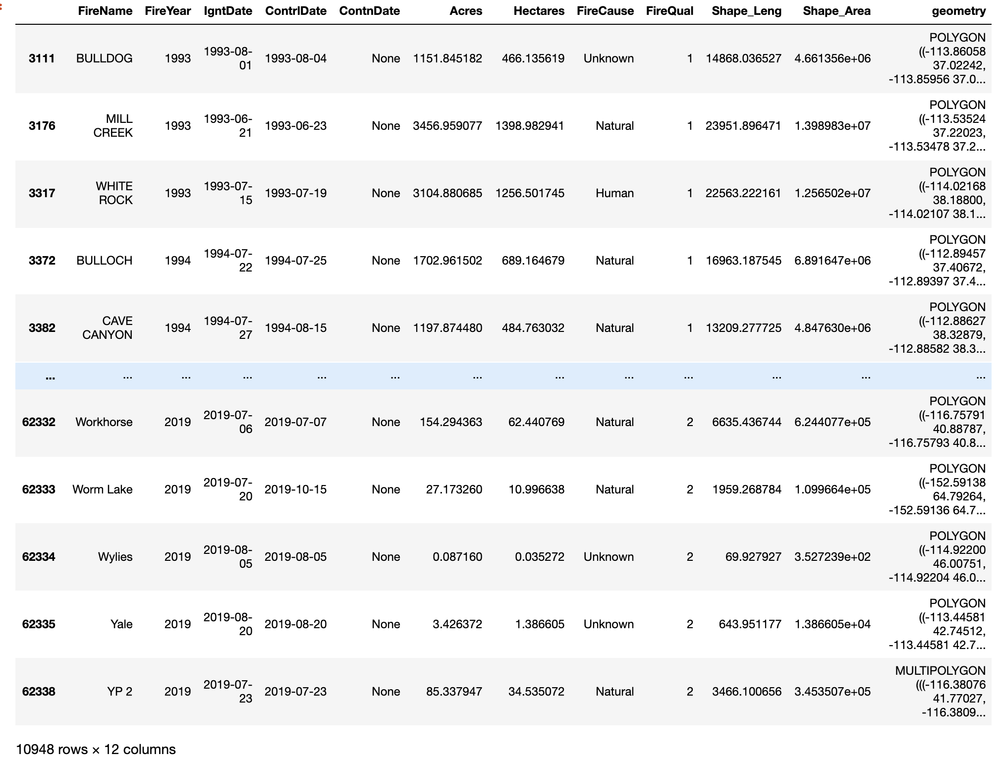
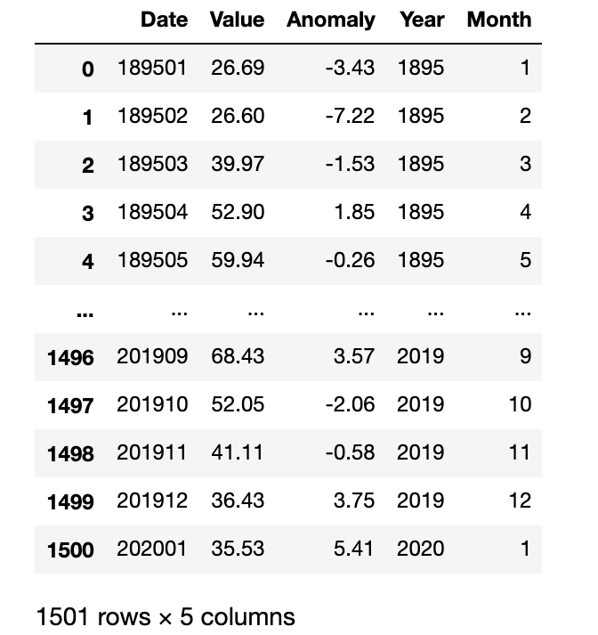

# Patterns of Destruction: Wildfires in the United States

## I. Introduction

Wildfires are becoming more destructive. Data shows an increasing trend in acreage burned per year. This increase also drives up the annual cost to control these destructive forces. The [Congressional Research Service](https://fas.org/sgp/crs/misc/IF10244.pdf) calculated the impact of wildland fires over the past decade (2011-2020). An average of 62,693 wildland fires occur annually, roughly 7.5 million acres annually are impacted by these fires. Although the majority of wildland fires occur in undeveloped areas which have little impact on communities or human development, they impact all of us. These fires occur mostly on federal lands (roughly 65%). Federal lands are land that is held in trust by the federal government, which is for the enjoyment of all Americans. Federal lands account for roughly 28% of land in the United States, approximately 640 million acres. 

[Population Density](https://www2.census.gov/geo/pdfs/maps-data/maps/thematic/us_popdensity_2010map.pdf) trends show how the majority of the U.S. population is not directly affected by these destructive forces. However, they do impact land that you as an American are entitled to recreate on. If you've ever been to one of the many national parks in the western part of the country, you've likely seen the effects of wildland fires. The increase in wildfires as well as their severity can be attributed to climate change. According to the [NOAA 2019 Global Climate Summary](https://www.ncdc.noaa.gov/sotc/global/201913), The five warmest years in the 1880–2019 record have all occurred since 2015, while nine of the 10 warmest years have occurred since 2005. The global annual temperature has increased at an average rate of 0.07°C (0.13°F) per decade since 1880 and over twice that rate (+0.18°C / +0.32°F) since 1981. Not only are temperatures rising, [precipitation levels are decreasing](https://www.epa.gov/climate-indicators/climate-change-indicators-drought). 

 

Data show that wildfires are mostly occur during the warmer, drier summer months. Specifically, May through September. Climate change data indicates those months are also becoming warmer and more arid. The combination of these climatic changes have directly affected the frequency and severity of wildfires. 

This project serves as an educational tool to the large section of our population that is not affected first-hand by these destructive forces. For those who live without the threat of their homes being engulfed by wildfire, it is easy to forget the immense impact they have on such a massive part of the country. For those who do live with the cyclical threat of wildfires, this project will tell their story, the growing concern of how to manage wildfires as a naturally occurring process, as well as protecting property from their destructive path. 

Displaying wildfire data in a visual format allows the user to see patterns that would otherwise go unnoticed in a tabular form. The sheer size and quantity of this phenomena lends itself to visual representation. My hope is that through the exploration of this project, the user will become more aware of the trend of larger, and more frequent wildfires, and the impact climate change has had (and will continue to have). Bringing awareness to the issue is the first step towards developing solutions to the problem of living symbiotically with such a powerful, yet destructive natural force. 

## II. Methodology

Data for this project was acquired through a variety of sources listed below, then analyzed and cleaned and prepared for web mapping using QGIS and Python. Jupyter Notebooks were used to document data analysis and the data cleaning process for a transparent and replicable approach. 

### A. Data

[Wildfire data](https://www.sciencebase.gov/catalog/item/5ee13de982ce3bd58d7be7e7) was downloaded and the shapefile was loaded in a Jupyter Notebook (`notebooks/wildfire-polygon-data.ipynb`) using the [GeoPandas](https://geopandas.org/) library. Analysis was performed using [pandas](https://pandas.pydata.org/) and [matplotlib](https://matplotlib.org/3.3.2/index.html) for visualizations. The dataset contains 65,845 records spanning 128 years. The dataset was reprojected from NAD83 to WGS84 for web mapping. It was then narrowed to the past century, and only records from 1920 to present were kept, narrowing the data to 62,744 records. That dataset was then filtered out records with null values in the ignition date and controlled date columns. The remaining dataset contains 10,948 records.

**Sample Wildfire Data:**

 

[Climate data](https://www.ncdc.noaa.gov/cag/national/time-series/110/tavg/all/1/1895-2020?base_prd=true&begbaseyear=1901&endbaseyear=2000) was downloaded as separate CSV files. One for historic temperatures, and one for historic precipitation. Each was loaded into a Jupyter Notebook (`notebooks/climate-data.ipynb`) using pandas. The data was fairly clean with one exception. The Date column concatenated year and month. After separating the month and year, separate columns were added for each. This aided in visualizing trends. Climate trends indicate warming average temperature year-over-year. When investigated further, the fire season months of June and August are warming at rates faster than the rest of fires season months (May-September). As the Palmer Drought Index above shows, our recent past (from 2000-present) has been drier than average. Warmer that average temperatures, combined with less precipitation than average, create a weather pattern that is conducive to large scale wildfires. 

### B. Medium for Delivery

The map is a web browser-based application accessible across mobile and desktop devices. It utilizes HTML, [Bootstrap](https://getbootstrap.com/) and [Assembly](https://labs.mapbox.com/assembly/) for CSS, and a variety of JavaScript libraries. 

### C. Application Layout

Insert Wireframe sketches

### D. Thematic Representation

Wildfire polygons rendered on a map of the United States to display how much land is consumed by wildfire each year. The intent is for trends to be visually apparent as the user toggles the slider across time. Tooltips provide further detail regarding a user selected fire polygon. Scale is the major factor for the project. The scale at which the map is originally rendered (the entire contiguous United States) somewhat diminishes the impact as polygons blend at that scale. Further considerations about scale will be taken into account as the project develops.  

### E. User Interaction

The map will be prominently displayed across the majority of the screen, a small navigation bar across the top of the screen will hold the title, an About link which will lead to this README within the project repository, and a dropdown menu where the user will select a fire year. The fire polygons from the user selected year will render on the map starting with the fires that ignited during January. There will be a time slider at the bottom left of the screen which the user will utilize to change months within the pre-selected year. When the user toggles the time slider from right to left, the fire polygons will cycle through the year starting with January and ending in December. The polygons will be rendered and removed from the map based on ignition date and controlled dates. Users will also be able to pan and zoom within the map frame to further investigate the fire polygons. When the user mouses over the polygon a visual affordance will render the polygon border to identify the specific fire. When the user clicks the polygon, a tooltip will appear with additional fire information.

### F. Aesthetic and Design Considerations

Design is simple and clean with little to distract the user from the mapped data. The base map will be dark, and the fire polygons will be a glowing orange-red to represent flames. UI is minimal and unobtrusive to allow data trends to standout. Intuitive design features and functionality create an enjoyable user experience, while providing substantial data in an easily digestible format.

### G. Conclusion

Wildfires are a devastating force that ravage our natural resources and threaten human development. Ironically, it is in part human development that has made them more ferocious. While wildfires are a process of rejuvenation, climate change is having an exacerbating effect. Climate change is not uniform event. It doesn't cause temperatures to increase linearly, nor precipitation to drop in a similar fashion. It is highlighted by more frequent extreme events. In the case of wildfires, more severe droughts coupled with warmer temperatures create an environment primed for megafires. As the data show, outlier events are becoming larger and more frequent. This is the new reality we are faced with. In order to have the ability to implement positive solutions, we must first recognize the situation and the causal factors. Megafires are becoming more frequent and more severe as human development expands and climate change creates prime wildfire conditions.   

### Data Sources

[Combined wildfire datasets for the United States and certain territories, 1878-2019](https://www.sciencebase.gov/catalog/item/5ee13de982ce3bd58d7be7e7)

[Historical US climate data](https://www.ncdc.noaa.gov/cag/national/time-series/110/tavg/all/1/1895-2020?base_prd=true&begbaseyear=1901&endbaseyear=2000)

[MTBS Point and Polygon datasets](https://data.fs.usda.gov/geodata/edw/datasets.php?xmlKeyword=fire)

[Forest Area](https://data.worldbank.org/indicator/AG.LND.FRST.ZS?end=2016&start=1990)

[US Deforestation](https://www.globalforestwatch.org/dashboards/country/USA/?category=summary&location=WyJjb3VudHJ5IiwiVVNBIl0%3D&map=eyJjZW50ZXIiOnsibGF0Ijo1My4zODMzMjgzNjc1Nzk0NjYsImxuZyI6LTExNi42MzA4NTkzNzQ5ODUxMn0sImNhbkJvdW5kIjpmYWxzZSwiZGF0YXNldHMiOlt7ImRhdGFzZXQiOiJwb2xpdGljYWwtYm91bmRhcmllcyIsImxheWVycyI6WyJkaXNwdXRlZC1wb2xpdGljYWwtYm91bmRhcmllcyIsInBvbGl0aWNhbC1ib3VuZGFyaWVzIl0sImJvdW5kYXJ5Ijp0cnVlLCJvcGFjaXR5IjoxLCJ2aXNpYmlsaXR5Ijp0cnVlfSx7ImRhdGFzZXQiOiJ0cmVlLWNvdmVyLWxvc3MiLCJsYXllcnMiOlsidHJlZS1jb3Zlci1sb3NzIl0sIm9wYWNpdHkiOjEsInZpc2liaWxpdHkiOnRydWUsInBhcmFtcyI6eyJ0aHJlc2giOjMwLCJ2aXNpYmlsaXR5Ijp0cnVlfX1dfQ%3D%3D&national-land-cover-database=eyJpbnRlcmFjdGlvbiI6e319)